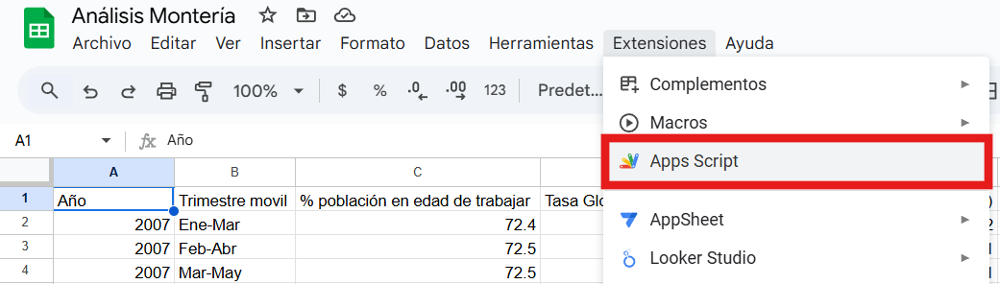

# Script updateData 1.0

 

updateData es un script que permite a su usuario actualizar los datos del mercado laboral para la ciudad de Monteria en un libro de Google Sheets.

El script toma los datos de los anexos técnicos de las encuestas GEIH realizadas por el Departamento Administrativo Nacional de Estadística (DANE) y coloca los datos en una disposición predeterminada en otro libro de Google Sheets. Dicha Disposición es la siguiente:

1. **Libro "Análisis Montería"**
   
    **1.1) hoja "Monteria"**: Datos principales del anexo "Empleo y desempleo" para la ciudad de Montería. Esta hoja contiene, en forma de columnas, los siguientes datos:

    * Año
    * Trimestre movil
    * % población en edad de trabajar
    * Tasa Global de Participación (TGP)
    * Tasa de Ocupación (TO)
    * Tasa de desocupación (TD)
    * Tasa de subocupación (TS)
    * Población total
    * Población en edad de trabajar (PET)
    * Fuerza de trabajo
    * Población ocupada
    * Población desocupada
    * Población fuera de la fuerza de trabajo
    * Subocupados
    * Fuerza de trabajo potencial

    **1.2) hoja "TD Pares regionales"**: Datos de Tasa de desocupación (TD) de las siete capitales de la costa caribe. Tomados del anexo "Empleo y desempleo". Esta hoja contiene, en forma de columnas, los siguientes datos:
    
    * Año
    * Trimestre movil
    * TD-Montería
    * TD-Riohacha
    * TD-Valledupar
    * TD-Santa Marta
    * TD-Barranquilla
    * TD-Cartagena
    * TD-Sincelejo
  

    **1.3) hoja "TD Pares económicos"**: Datos de TD de siete ciudades comparables con Montería por valor agregado al PIB departamental. Tomados del anexo "Empleo y desempleo". Esta hoja contiene, en forma de columnas, los siguientes datos:

    * Año
    * Trimestre movil
    * TD-Montería
    * TD-Neiva
    * TD-Santa Marta
    * TD-Pasto
    * TD-Valledupar
    * TD-Popayán
    * TD-Armenia

    **1.4) hoja "Distribución PFFT"**: Datos de como se distribuye, según la actividad, la Población Fuera de la Fuerza de Trabajo (PFFT) en la ciudad de Montería. Tomados del anexo "Empleo y desempleo". Esta hoja contiene, en forma de columnas, los siguientes datos:

    * Año
    * Trimestre movil
    * Estudiando
    * Oficios del hogar
    * Otros

    **1.5) hoja "Ocupados Monteria por ramas"**: Datos de ocupación por rama de actividad económica. Tomados del anexo "Empleo y desempleo". Esta hoja contiene, en forma de columnas, los siguientes datos:

    * Año
    * Trimestre movil
    * Población ocupada
    * No informa
    * Agricultura, ganadería, caza, silvicultura y pesca
    * Explotación de minas y canteras
    * Industrias manufactureras
    * Suministro de electricidad gas, agua y gestión de desechos
    * Construcción
    * Comercio y reparación de vehículos
    * Alojamiento y servicios de comida
    * Transporte y almacenamiento
    * Información y comunicaciones
    * Actividades financieras y de seguros
    * Actividades inmobiliarias
    * Actividades profesionales, científicas, técnicas y servicios administrativos
    * Administración pública y defensa, educación y atención de la salud humana
    * Actividades artísticas, entretenimiento, recreación y otras actividades de servicios
  

    En el libro de "Análisis Montería" las hojas cuyos datos se obtienen del anexo "Empleo y desempleo" se colorean de verde.

    **1.6) hoja "Formales e informales Monteria"**: Datos sobre ocupados formales e informales en la ciudad de Montería. Tomados del anexo "Empleo informal y seguridad social". Esta hoja contiene, en forma de columnas, los siguientes datos:

    * Año
    * Trimestre movil
    * Población ocupada
    * Formal
    * Informal

    **1.7) Proporción de Informalidad**: Datos sobre el porcentaje de informales con respecto a la población ocupada. Tomados del anexo "Empleo y seguridad social". Esta hoja contiene la proporción de informalidad, en forma de columnas, de las siguientes ciudades:

    * Total nacional
    * 13 Ciudades y A.M.
    * 23 Ciudades y A.M.
    * Bogotá D.C.
    * Medellín A.M.
    * Cali A.M.
    * Barranquilla A.M.
    * Bucaramanga A.M.
    * Manizales A.M.
    * Pasto
    * Pereira A.M.
    * Cúcuta A.M.
    * Ibagué
    * Montería
    * Cartagena
    * Villavicencio
    * Tunja
    * Florencia
    * Popayán
    * Valledupar
    * Quibdó
    * Neiva
    * Riohacha
    * Santa Marta
    * Armenia
    * Sincelejo

    En el libro, las dos hojas anteriores se colorean de rojo porque sus datos provienen del anexo "Empleo informal y seguridad social".

    **1.8) Monteria Joven**: Datos sobre el mercado laboral de la juventud en la ciudad de Monteria. Tomados del anexo "Mercado laboral de la juventud". Adicional, esta hoja la encontramos coloreada de azul. Esta hoja contiene, en forma de columnas, los siguientes datos:

    * Año	
    * Trimestre movil	
    * % PET Joven	
    * TGP Joven	
    * TO Joven	
    * TD Joven	
    * % PFFT Joven/ PET Joven	
    * PET	
    * PET Joven	
    * FT Joven	
    * PO Joven	
    * PD Joven	
    * PFFT Joven

    **1.9) Monteria por sexo**: Datos sobre el mercado laboral según sexo en la ciudad de Monteria. Tomados del anexo "Mercado laboral según sexo". Esta hoja se encuentra coloreada de rosado. Esta hoja contiene, en forma de columnas, los siguientes datos:

    * Año	
    * Trimestre movil	
    * % PET-Hombres	
    * TGP-Hombres	
    * TO-Hombres	
    * TD-Hombres	
    * Población total (Hombres)	
    * PET-Hombres	
    * FT-Hombres	
    * PO-Hombres	
    * PD-Hombres	
    * % PET-Mujeres	
    * TGP-Mujeres	
    * TO-Mujeres	
    * TD-Mujeres	
    * Población total (Mujeres)
    * PET-Mujeres	
    * FT-Mujeres	
    * PO-Mujeres	
    * PD-Mujeres

    
## ¿Cómo usar este Script?
### 1. Libro con la disposición indicada
Lo primero que necesitamos es un libro de Google Sheets con los datos en la disposición que se indico anteriormente. A continuación, se deja un libro con dicha disposición: [Análisis Montería](https://docs.google.com/spreadsheets/d/16PazXBuSfElwYLePgG1U3qQmb3URxZb4ogVQ925HgiU/edit?gid=1245319174#gid=1245319174).

Este paso incluye el nombre de las hojas del libro de Google Sheets.
### 2. Descargar los anexos del DANE 
Debemos descargar los siguientes anexos:

*  Empleo y desempleo.
*  Empleo informal y seguridad social.
*  Mercado laboral de la juventud.
*  Mercado laboral según sexo.

Luego, debemos renombrarlos justo como la lista de arriba (ejemplo: si descargamos el anexo de "Empleo y desempleo" renombramos el archivo de Excel como "Empleo y desempleo") luego convertir esos archivos a libros de Google Sheets ya que originalmente vienen en formato de libro de Excel y eliminar los archivos de Excel (son los que terminan en "xlsx"). El link para acceder a esos anexos es el siguiente:
[Mercado laboral](https://www.dane.gov.co/index.php/estadisticas-por-tema/mercado-laboral).

Cuando queramos convertir un archivo de Excel que tengamos en Drive a un archivo de Google Sheets, nos aparecerá la siguiente opción:

### 3. Insertar el script

Para insertar el scritp se requiere hacer lo siguiente:

1. Copiar el script. 
2. Ingresar al archivo donde queremos colocar el script
3. Ingresar a Apps Script, ingresando a "Extensiones -> Apps Script".

1. Remplazamos lo que encontremos por el script

1. Ejecutar el script: Cuando lo use por primera vez, le pedirá permisos de ejecución:

Cuando vemoas el aviso anterior, damos click en "Revisar permisos" y nos pedirá iniciar sesión con Google:

Seleccionamos una cuenta y nos aparecerá el siguiente aviso:

En el aviso, Google nos dice que el script no ha sido verificado: No hay nada de que preocuparse, el script es de código abierto por lo cual es posible verificar todo lo que este hace.

Para dar el permiso se debe dar click en "Configuración avanzada":

Luego damos click donde dice "Ir a updateData 1.0" y nos aparecerá lo siguiente:

Damos click en "Permitir" y se ejecutará el script así que nos devolvemos a nuestra hoja:

Nos aparecerá un cuadro solicitando el año de los datos, cuando lo veamos por primera vez damos click en "Cancelar" debido a que no ha cargado aún el menu de actualización y recargamos la hoja.
Una vez recargada  ya podremos ver el menu de "Actualizar datos del mercado laboral" y seremos libres
de usar el script cuando lo queramos.

### 4. Explicación del menu de "updateData"
El menu "updateData" tiene las siguientes cuatro opciones:

* **Actualizar datos de Montería, pares regionales y económicos**: Esta opción actualiza los datos sobre las hojas "Monteria";"TD pares regionales"; "TD pares económicos";"Distribución PFFT"  y "Ocupados Monteria por ramas" ya que la información de esas hojas se obtiene del anexo "Empleo y desempleo" y por prácticidad se han coloreado de color verde.
  
* **Actualizar datos sobre informalidad**: Esta opción actualiza los datos de las hojas "Formales e informales Monteria" y "Proporcion de Informalidad" ya que la información de estas hojas se obtienen del anexo "Empleo informal y seguridad social" y por prácticidad se han coloreado de rojo.

* **Actualizar datos sobre el mercado laboral de la juventud**: Esta opción actualiza la hoja "Monteria Joven" utilizando la información del anexo "Mercado laboral de la juventud" y por practicidad se ha coloreado de azul.

* **Actualizar datos sobre mercado laboral según sexo**: Esta opción actualiza la hoja "Monteria por sexo" utilizando la información del anexo "Mercado laboral según sexo" y por prácticidad se ha coloreado de rosado.

Cuando demos click en cualquiera de las opciones del menu, nos saldrá un cuadro solicitando el año de los datos, es decir, el año para el que corresponde la información publicada no el año actual. Ejemplo: Los datos del trimestre Oct-Dic de 2024 se publican en Enero de 2025, por tanto, se debe colocar el año 2024. Adicional, el año debe ser un digito de 4 caracteres.

## ¿Cómo funciona el script?

El script toma los datos de la última columna en las hojas de los anexos del DANE que nos interesan, lo cual permite obtener la información de la última publicación, por tanto, si a nuestra hoja le hacen falta esos datos del mercado laboral, entonces podemos utilizar este script para actualizar nuestra información.

Por lo anterior, se recomienda actualizar la hoja con cada publicación que realice el DANE utilizando updateData para realizar está labor rápidamente.

Adicional, crea un rango nombrando para cada tabla dentro de las hojas mencionadas y dicho rango cambia cada vez que se actualiza la información; esto se hace con la intención de utilizar las tablas como fuente de datos para cualquier herramienta de análisis de datos como pueden ser Power BI, Tableau, Looker y muchos otros Los nombres de  los rangos de datos son los siguientes:

* **hoja "Monteria"**: En esta hoja la tabla (el rango con nombre)también se llama "Monteria".
* **hoja "TD pares regionales"**: En esta hoja la tabla se llama "TD_Ciudades_costa_caribe".
* **hoja "TD pares economicos**: En esta hoja la tabla se llama "TD_Ciudades_comp_econ".
* **hoja "Distribución PFFT"**: En esta hoja la tabla se llama "Distribucion_PFFT".
* **hoja "Ocupados Monteria por ramas"**: En esta hoja la tabla se llama "ocupados_Monteria_segun_rama".
* **hoja "Formales e informales Monteria"**: En esta hoja la tabla se llama "formales_e_informales".
* **hoja "Proporcion de Informalidad"**: En esta hoja la tabla se llama "Informalidad".
* **hoja "Monteria Joven"**: En esta hoja la tabla se llama "Monteria_Joven".
* **hoja "Monteria por sexo"**: En esta hoja la tabla se llama "Monteria_por_S".
